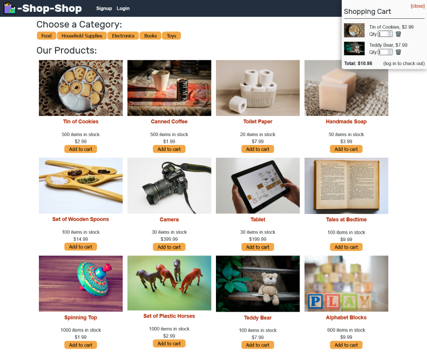

# E-Commerce (Redux)

## Description
This is a simple e-commerce app that allows users to select products from a catalogue, store them in their cart, and (test) checkout with [Stripe](https://stripe.com/docs).  My work was on the front-end, adding [Redux](https://redux.js.org/) to manage state.

## Installation
Running `npm install` in the project's root will install all dependencies in both the client and server.  Running `npm run build` will build the client for production.  The app requires a MongoDB database, and for the `MONGODB_URI` environment variable to be set (unless the default of `mongodb://127.0.0.1:27017/mern-shopping` is used).

## Usage
You can browse available products from the homepage, and filter them by category.  Clicking on an item will link to a product page with a bigger picture and more details.  You can adjust the quantity of an item you wish to purchase either by using the shopping cart menu in the top right, or by clicking on the `Add to cart` and `Remove from cart` buttons in the catalogue (the remove button only appears on a products details page).  If you are logged in, the shopping cart will let you proceed to checkout, which links to Stripe.  [Stripe's testing document explains how to make a fake transaction](https://stripe.com/docs/testing).

[Try it live on Heroku](https://s2robertson-e-commerce-846d9d6054b8.herokuapp.com/)

## Screenshot

## Credits
The original files were provided by University of Toronto Coding Bootcamp.  The original app was fully function; my assignment was to retrofit it with Redux.

## License
MIT